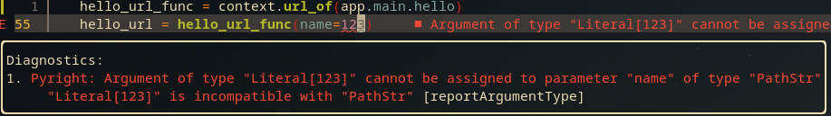
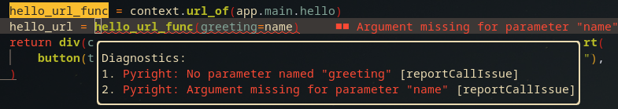

# relax-py

A Python web development framework for `htmx` and `tailwindcss`, with hot module replacement, built on top of [Starlette](https://www.starlette.io/).

## Features

- URL locators based on path functions, with errors based on type annotations.
- Write HTML templates with Python functions.
- Dependency injection helpers
- hot module reload

[](https://youtu.be/94ayMovjNpw)


## Usage

Starter example with hot module replacement:

In `app/main.py`:

```py
from relax.app import (
    App,
    HTMLResponse,
    PathStr,
    Request,
    Router,
    ViewContext,
    websocket_endpoint,
)
from relax.html import div
from relax.injection import Injected, add_injectable
from relax.config import BaseConfig
from relax.server import start_app

import app.templates

router = Router()


@router.path_function("GET", "/hello/{name}")
async def hello(
    request: Request, name: PathStr, *, config: BaseConfig = Injected
) -> HTMLResponse:
    if config.ENV == "dev":
        name = f"dev {name}"
    template = app.templates.greeting_template(name)
    if request.scope["from_htmx"]:
        return HTMLResponse(template)
    else:
        return HTMLResponse(app.templates.page_root(template))


@router.path_function("GET", "/")
async def home(request: Request) -> HTMLResponse:
    if request.scope["from_htmx"]:
        return HTMLResponse(div(text="Request from htmx not supported on home page"))
    return HTMLResponse(app.templates.page_root(app.templates.home_page()))


def app_factory() -> App:
    config = BaseConfig()
    add_injectable(BaseConfig, config)

    view_context = ViewContext()
    add_injectable(ViewContext, view_context)

    app = App(config=config, view_context=view_context)
    app.add_router(router)
    if config.ENV == "dev":
        app.add_websocket_route("/ws", websocket_endpoint, name="ws")
        app.listen_to_template_changes()

    return app


if __name__ == "__main__":
    config = BaseConfig()
    start_app(
        app_path="app.main:app_factory",
        config=config,
        host="0.0.0.0",
        port=8000,
        reload=True,
    )
```

In `app/templates/__init__.py`:

```py
from relax.app import ViewContext
from relax.html import (
    Element,
    body,
    button,
    div,
    head,
    hmr_script,
    html,
    meta,
    script,
    title,
)
from relax.injection import Injected, component

import app.main


def page_root(child: Element) -> Element:
    head_element = head().insert(
        title("Example app"),
        meta(charset="UTF-8"),
        meta(
            name="viewport",
            content="width=device-width, initial-scale=1.0, maximum-scale=1.0",
        ),
        script(
            src="https://unpkg.com/htmx.org@1.9.5",
            attrs={
                "integrity": "sha384-xcuj3WpfgjlKF+FXhSQF"
                "Q0ZNr39ln+hwjN3npfM9VBnUskLolQAcN80McRIVOPuO",
                "crossorigin": "anonymous",
            },
        ),
        script(src="https://cdn.tailwindcss.com"),
        hmr_script(),
    )
    return html(lang="en").insert(
        head_element,
        body(classes=["p-4"]).insert(child),
    )


@component(key=lambda name: name)
def greeting_template(name: str) -> Element:
    return div(
        classes=["m-auto", "bg-blue-200", "p-2", "w-max", "rounded-md"],
        text=f"Hello, {name}!",
    )


@component()
def home_page(*, context: ViewContext = Injected, id: str = Injected) -> Element:
    name = "World"
    hello_url_func = context.url_of(app.main.hello)
    hello_url = hello_url_func(name=name)
    return div(classes=["m-auto", "bg-green-400", "p-2", "rounded-lg", "w-max"]).insert(
        button(text="Greet").hx_get(hello_url, hx_target=f"#{id}", hx_swap="outerHTML"),
    )
```

then run the app with:

```sh
env ENV=dev TEMPLATES_DIR=app/templates python app/main.py
```

and open the browser at `http://localhost:8000`.

Go ahead, edit the templates and see the changes reflected in the browser!

## Walkthrough

Let's go through the code and talk about the interesting parts.  
We'll start with the `main.py` file, and then move to the `templates`.

### main.py

```py
router = Router()
```

We use a `Router` object from `relax` to define separate routes.

```py
@router.path_function("GET", "/hello")
```

Path functions are defined using the `path_function` decorator.

```py
async def hello(
    request: Request, name: PathStr, *, config: BaseConfig = Injected
) -> HTMLResponse:
```

Path functions need to be `async`, and the first argument **must** be a `Request` object.  

Additionally, we can configure the path parameters (and query parameters) using the type annotations.  
`PathStr` corresponds to a string path parameter, but there's also `PathInt`, and you can create your own.
Additionally, we can inject dependencies using the `Injected` default value of the parameters.  
Note that all the injected values need to be keyword-only arguments, and they choose what to inject with the annotation of the parameter.  

> there are more decorators that provide injection: `@component`, which provides other benefits as well, which we'll see in the templates, and `@injectable`/`@injectable_sync` which do not provide anything other than injection, making it suitable for service level functions.  
Finally, we return an `HTMLResponse` object, which is a subclass of `starlette.responses.Response` that takes an `Element` object from `relax.html` and ensure we return a valid HTML response.

```py
if request.scope["from_htmx"]:
        return HTMLResponse(template)
    else:
        return HTMLResponse(app.templates.page_root(template))
```

The `Request` object has `request.scope["from_htmx"]`, which can be used to check if the request came from an `htmx` request.  
Depending on the result, we can return either a partial HTML template, to be inserted in the current page, or a full HTML document.

```py
def app_factory() -> App:
    config = BaseConfig()
    add_injectable(BaseConfig, config)
```

The only way to initiate an app with `relax` is to use a factory function that returns an `App` object.  
`relax` provides a `BaseConfig` object that can store the app configuration, and which you are encouraged to subclass in our own application.  
In the factory function we can also setup the dependency injection, by mapping types to instantiated objects.  

```py
view_context = ViewContext()
add_injectable(ViewContext, view_context)
```

The `ViewContext` object is a helper meant to be injected into templates and help with the rendering.  
Its most common use is locating the URLs of path functions, as we'll see in the templates.

```py
if config.ENV == "dev":
    app.add_websocket_route("/ws", websocket_endpoint, name="ws")
    app.listen_to_template_changes()
```

`relax` relies on a websocket connection to the browser to allow hot module replacement, so we need to add a websocket route.  
The websocket connection code is in `relax`, but we want to make it obvious where it's added, so we make the consumer have to add the route.
We also add an `async` task that will listen for changes in the templates and notify the browser to reload the page.

```py
start_app(
    app_path="app.main:app_factory",
    config=config,
    host="0.0.0.0",
    port=8000,
    reload=True,
)
```

Internally, `relax` still uses `uvicorn` as the ASGI server, so the arguments to `start_app` match the flags we would pass to `uvicorn`.

### templates

Why did we put the templates in the `__init__.py` file?  
Because `relax` needs all the template functions to be in a single folder, and it's ideal that that folder has only template functions (since when hot module replacement is used, `uvicorn` will not reload the app when files in that folder change)  
Since we only have one file with templates, we can put them all in the `__init__.py` file, but in a real project, you'll likely have multiple files in the directory.

```py
@component(key=lambda name: name)
def greeting_template(name: str) -> Element:
```

The `@component` decorator provides a few benefits to our templates:

- ensures hot module replacement
    - only HTML code that falls under a `@component` decorator will be reloaded
    - so, if there's a `@component` template function that calls a non-decorated template function, you'll still get hot module replacement
- automatically generates an `id` for the returned HTML element
    - the `key` parameter of the decorator can be used to guarantee the uniqueness of the component
        - might seem similar to how `key` is used in loops in React, but here is at a global level
        - in this case, the `key` is a lambda function that takes the same `name` parameter as the `greeting_template` function, and outputs a string that should be unique to that component.
          - this is very useful when the component takes an object as a parameter, such as a `pydantic` object
    - the `id` of each element can be injected as a parameter
- automatically generates a CSS class that identifies the returned HTML element
    - while not used in this example, these can be automatically inserted into a `CONSTANTS.js` file with the `update_js_constants` function
    - this makes server-python <-> client-javascript interoperability a little nicer
- provides dependency injection, in the same way the `@path_function`, `@injectable`, and `@injectable_sync` decorators do


```py
def page_root(child: Element) -> Element:
```

With this, we can have a single template function that creates a full HTML document, and we can reuse it in all the other templates.
Elements can be nested just like when writing HTML.

```py
script(
    src="https://unpkg.com/htmx.org@1.9.5",
    attrs={
        "integrity": "sha384-xcuj3WpfgjlKF+FXhSQF"
        "Q0ZNr39ln+hwjN3npfM9VBnUskLolQAcN80McRIVOPuO",
        "crossorigin": "anonymous",
    },
),
script(src="https://cdn.tailwindcss.com"),
hmr_script(),
```

To make `htmx` and `tailwindcss` work, we need to include the scripts in the HTML.  
Note that for `tailwindcss`, you wouldn't use the CDN in production, but rather something like [pytailwind](https://github.com/timonweb/pytailwindcss) to generate only the CSS you need (check out the example app from the [Other](./other.md) page) to see a possible implementation.
We also include the hot module replacement script that connects to the websocket server created in `main.py`.

```py
return div(
        classes=["m-auto", "bg-blue-200", "p-2", "w-max", "rounded-md"],
        text=f"Hello, {name}!",
    )
```

We define CSS classes as strings in a list.  
This makes it easier to reuse them, override them in other elements (in `tailwind` you can prepend `!` to a class to make it `!important`) and lets formatters handle line lengths.  
This would also make it easier to implement, in a potential future version, something like [tailwind-merge](https://github.com/dcastil/tailwind-merge)

```py
name = "World"
hello_url_func = context.url_of(app.main.hello)
hello_url = hello_url_func(name=name)
```

We can use the `ViewContext` object to locate the URL of a path function.  
We require that the path parameters are passed as keyword arguments, and not as positional arguments.  
The advantage of this approach is that we get type checking in our IDE:

And:


```py
return div(classes=["m-auto", "bg-green-400", "p-2", "rounded-lg", "w-max"]).insert(
    button(text="Greet").hx_get(hello_url, hx_target=f"#{id}", hx_swap="outerHTML"),
)
```

The way we make use of `htmx` is with the `hx_*` methods, which support pretty much the same arguments as the `htmx` attributes.

# About

## Inspiration

Creating HTML based on Python is based on [simple_html](<https://github.com/keithasaurus/simple_html>)

## Projects built with relax

- [memecry](https://github.com/crpier/memecry) - a meme website
